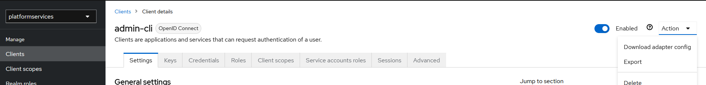

# Keycloak

[Keycloak](https://www.keycloak.org/ "keycloak.org") is the [Oauth](https://auth0.com/intro-to-iam/what-is-oauth-2 "What is OAuth 2.0?") and [SSO](https://en.wikipedia.org/wiki/Single_sign-on "What is SSO?") provider for the SeaSprig platform.

Keycloak is in charge of managing accounts for the platform's users, and it handles user account creation, deletion, login, and logout functionality. In addition to the above, Keycloak is also in charge of defining and enforcing [authorization and authentication](https://auth0.com/docs/get-started/identity-fundamentals/authentication-and-authorization "Authentication vs. Authorization") for not only the users but for the applications in the SeaSprig platform.

The basics of keycloak have been set up by hand already, and on boot the docker image imports that hand-crafted setup from a json file located in the ./keycloak/realmData/ directory.

If this startup data needs to be modified or goes out of date (eg: if keycloak updates in a non-compatible way) documentation on how to import a new config can be found [here](https://www.keycloak.org/server/importExport "importing and exporting realms")

Specifically, you can do a partial export through the UI here:

However, be aware that the export censors client passwords, so those will need to be replaced before reloaded into a new keycloak instance.

The basic steps for manually setting up keycloak involve logging in to the web interface with the admin user and configuring the admin-cli user by enabling client authentication as described [here](https://www.mastertheboss.com/keycloak/how-to-use-keycloak-admin-rest-api/ "how to use keycloak admin rest api")

As the above documentation describes, you will also need to find and copy the client secret from the admin-cli credentials tab, pasting that into the system [environment variables](environment.md)

At this point, applications with the admin-cli secret are capable of getting an authentication token from keycloak, but this token has limited permissions.

In order to manage users with this token, the client needs the 'manage-users' role added in the clients 'service accounts roles' tab as described [here](https://stackoverflow.com/questions/66452108/keycloak-get-users-returns-403-forbidden/75298584#75298584 "keycloak manage users")

At this point, the basics of keycloak have been configured. Tests for the SeaSprig applications that create users should be able to run, and that is an indicator that the configuration is ready to be exported and saved in source control